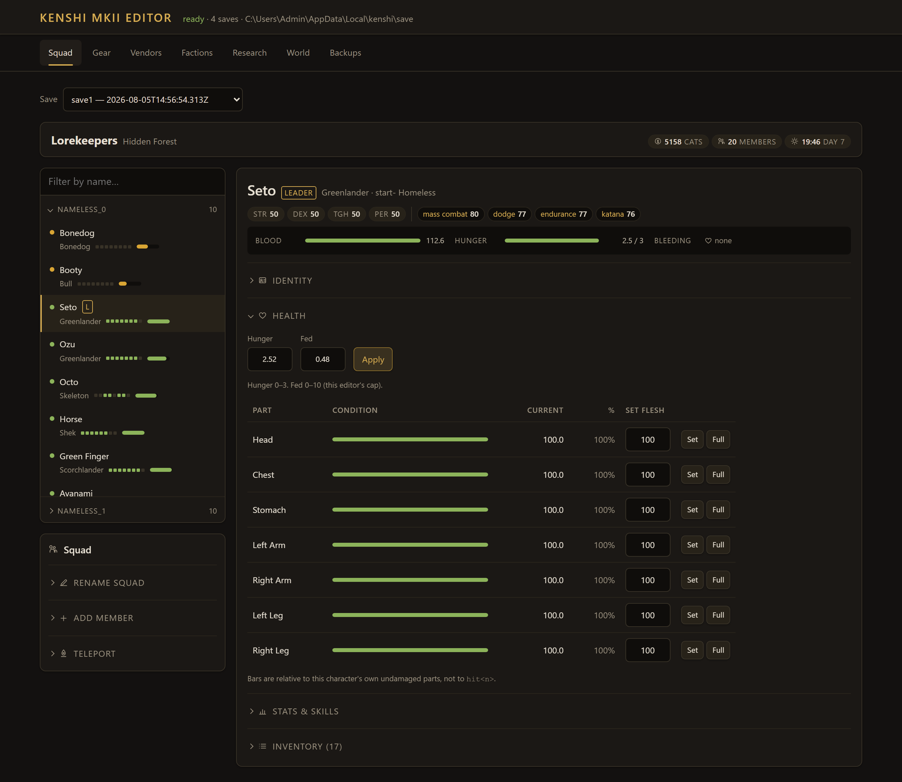
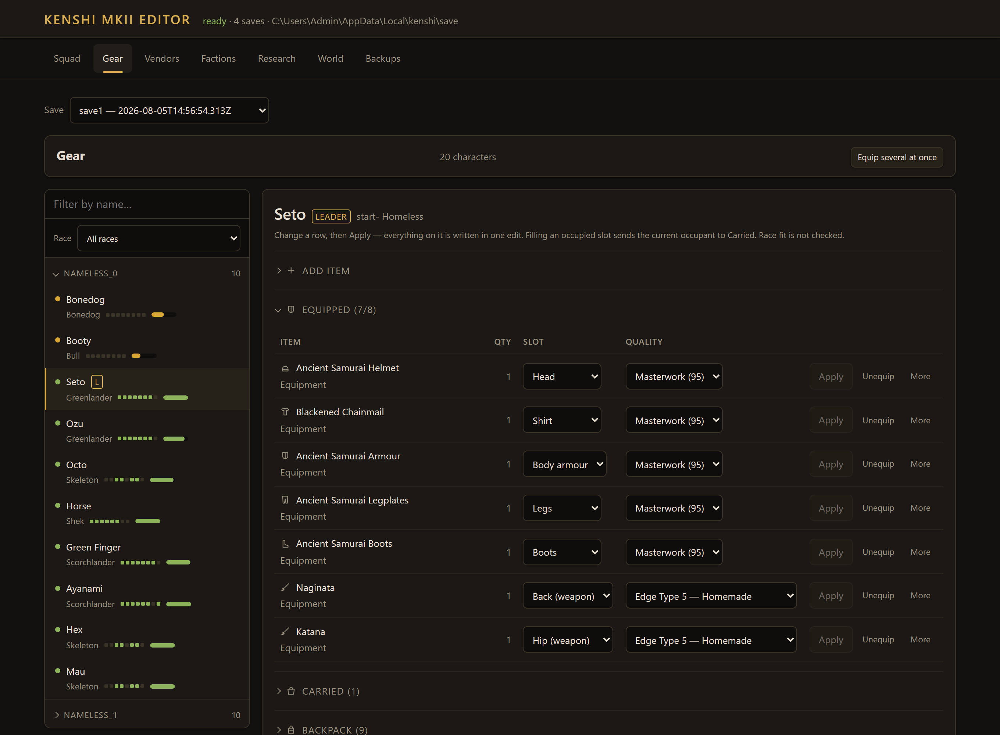
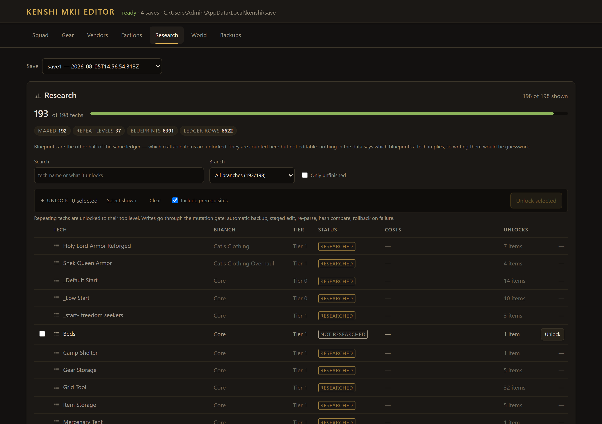
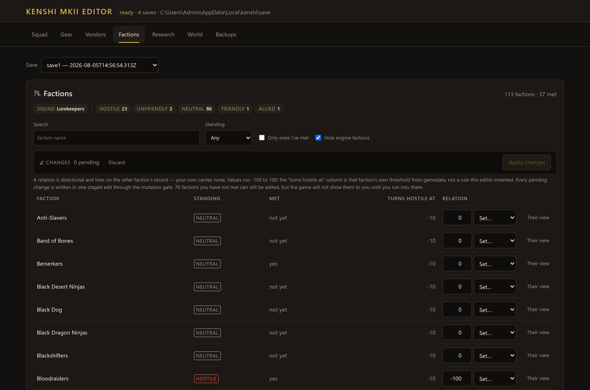
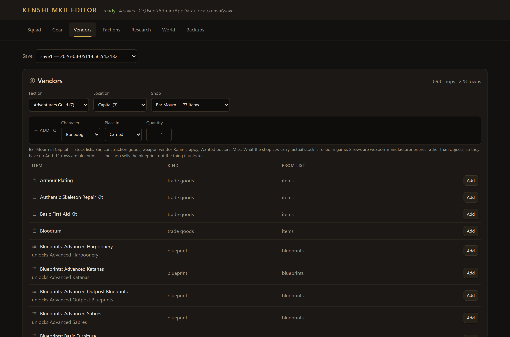
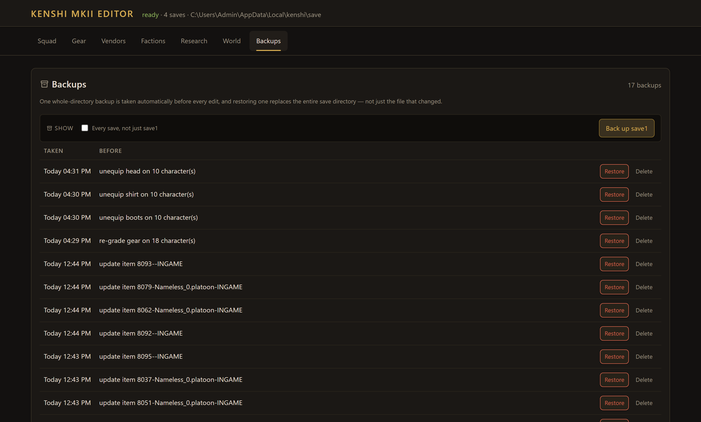

<div align="center">

# Kenshi MKII Editor

**A local save editor for *Kenshi*. Loopback only, staged writes, automatic backups, and not one byte written until the codec proves it can reproduce the file exactly.**

[](https://github.com/butteredstardust/kenshi-mkii-editor/releases/latest)
[](https://github.com/butteredstardust/kenshi-mkii-editor/actions/workflows/release.yml)
[](webapp/LICENSE)
[](https://nodejs.org)
[](https://github.com/butteredstardust/kenshi-mkii-editor/releases/latest)

</div>

Reads a [Kenshi](https://store.steampowered.com/app/233860/Kenshi/) save
directory, shows your squad — stats, wounds, inventory, factions, research,
world state — and edits it through a gated write path that backs up first and
rolls back on any failure.

Runs entirely on your machine, bound to loopback. No accounts, no telemetry, no
build step, one runtime dependency.

| Squad | Gear |
|---|---|
|  |  |
| Pick from the roster, edit one character: attributes, skills, wounds, hunger. | One row, one commit — slot, tier and weapon grade written in a single edit. |
|  |  |
| 198 techs resolved in the game's own mod load order, joined onto your ledger. | All 114 factions, keyed by stable gamedata ID rather than display name. |
|  |  |
| What each shop *can* carry, from the gamedata chain — and add any of it. | Whole-directory backups, one taken automatically before every edit. |

## Tech stack

| Category | Technology / detail |
|---|---|
| Runtime | Node.js `>=22`, no build step, no bundler |
| Framework | Express 4.x, bound to `127.0.0.1` only |
| Save format | Hand-derived binary codec (`webapp/services/kenshi/`), latin1, zero dependencies |
| Frontend | Vanilla ES modules, no bundler — `public/index.html` loads `public/app.mjs`, a six-line entry point; one module per tab under `public/modules/features/`; design system in `public/styles.css` |
| Testing | Node's built-in runner (`node --test`), 183 tests, including a byte-identical round trip of your live save |
| Dependencies | `express`, and nothing else |
| Cross-check | An independent Python implementation in `tools/py-reference/`, used to derive the format and confirm suspicious results |

## Requirements

- Node.js 22+ (the Windows installer bundles its own)
- Kenshi installed — the editor reads `gamedata.base` and your Workshop mods to
  turn ~62,000 internal string IDs into readable names, honouring your
  `mods.cfg` load order

## Install

Two routes, both covered step by step in [`INSTALL_GUIDE.md`](INSTALL_GUIDE.md):

- **Windows installer** — `kenshi-mkii-editor-<version>.exe` from
  [Releases](https://github.com/butteredstardust/kenshi-mkii-editor/releases/latest).
  Per-user, no elevation, bundles its own Node runtime, works offline. Build one
  from a checkout with
  `powershell -ExecutionPolicy Bypass -File releases\build.ps1`.
- **From source** — the three commands below.

## Quick start

The app lives in **`webapp/`** — there is no root `package.json`, so every
`npm`/`node` command runs from that directory.

```bash
cd webapp
npm install
npm start
```

Then open <http://127.0.0.1:3080>. Or double-click `webapp\start.bat`.

To stop it, close the console window, or run `webapp\stop.bat` (pass a port as
the first argument if you started it on a non-default one). It only kills
whatever is listening on that port, never every `node.exe` on the machine.

**Close Kenshi before editing.** The game holds the world in memory and rewrites
the save directory on save, so an edit applied while it is running is discarded
at best. The editor refuses to write while `kenshi_x64.exe` is up.

Console report without the browser:

```bash
node webapp/scripts/status.js          # newest save
node webapp/scripts/status.js save1    # a named save
```

## What it does today

- Auto-detects saves (`%LOCALAPPDATA%\kenshi\save\`), the Kenshi install and the
  workshop mod folder
- **Squad** — attributes, trained skills, per-body-part wounds,
  consciousness/coma/bleeding/hunger, race switching, personality, renaming,
  new members rolled from a catalogue of 50 recruits, and teleporting
- **Gear** — the full item catalog with slot icons and category filters,
  per-item edits committed one row at a time, bulk equip from 37 loadouts read
  off the game's own NPCs, bulk re-grade and bulk unequip, and advisory race-fit
  checks that report without ever blocking a write
- **Vendors** — who sells what, by faction, town and shop, resolved from the
  gamedata chain, with an Add straight into a character's inventory
- **Factions** — all 114 relations, directional and keyed by gamedata string ID,
  batched into one staged edit
- **Research** — 198 techs resolved in `mods.cfg` load order, joined onto this
  save's ledger, unlocked with or without prerequisites
- **Backups** — whole-directory copies with hash manifests, restore and delete

## Safety

- A save is a **directory**; backups and restores cover all of it
- Every write: automatic backup → staged copy → edit → re-parse → hash diff →
  re-check preconditions → install only changed files → receipt
- Any failure after the backup exists triggers an automatic restore
- A restore is staged beside the save and swapped in, so the save is never
  deleted ahead of a copy that might fail
- Bytes are only written after the codec proves it can round-trip the file
  byte-identically (`npm test` asserts this against your live save and against
  `gamedata.base`, `rebirth.mod`, `Newwworld.mod` and `Dialogue.mod`)

## Testing

```bash
cd webapp
npm test
```

183 tests. The one that matters reads every file in a real save and writes it
back in memory, then asserts SHA-256 equality. **No release ships unless it
passes** — if the codec cannot reproduce a file exactly, it does not understand
it, and writing to it would be corruption.

## Which doc do I read?

| Doc | Read it for |
|---|---|
| [`INSTALL_GUIDE.md`](INSTALL_GUIDE.md) | Installing, running, troubleshooting, and building the installer. |
| [`AGENTS.md`](AGENTS.md) | Canonical agent ruleset — architecture, safety model, format rules, conventions, full API surface. |
| [`CLAUDE.md`](CLAUDE.md) | Short Claude Code-specific supplement to `AGENTS.md`. |
| [`docs/save-format.md`](docs/save-format.md) | The byte-level save format and how it was reverse-engineered. |
| [`docs/ui-style-guide.md`](docs/ui-style-guide.md) | The design system and the rules for adding UI. |
| [`tools/py-reference/`](tools/py-reference/) | The independent Python implementation used to derive and cross-check the format. |
| [`CHANGELOG.md`](CHANGELOG.md) | What changed between versions. |
| [`ACKNOWLEDGEMENTS.md`](ACKNOWLEDGEMENTS.md) | Game-data attribution, third-party licences, and the unofficial-project disclaimer. |

## Licence

MIT, for the editor's source code — see [`webapp/LICENSE`](webapp/LICENSE). The
bundled item catalog derives from the Kenshi Wiki on Fandom and is redistributed
under CC BY-SA 3.0. This project is unofficial and not affiliated with Lo-Fi
Games; details in [`ACKNOWLEDGEMENTS.md`](ACKNOWLEDGEMENTS.md).

## Status

Early. The read path and the write pipeline are done and verified; the set of
available edits is deliberately small so far. The format was derived against
Kenshi 1.0.65 — after a game update, run `npm test` first, because the round
trip is the canary. See the open questions at the end of
[`docs/save-format.md`](docs/save-format.md).
